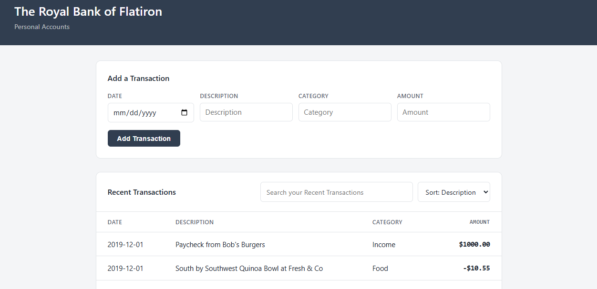

# The Royal Bank of Flatiron

A simple personal finance tracker built with React and a JSON server backend. Users can view recent transactions, add new ones, search by description, and sort the list by category or description.

## Features

- **View transactions** — all recent transactions load automatically on startup, showing date, description, category, and amount.
- **Add a transaction** — submit a new transaction through a form; it's saved to the backend and appears in the list immediately.
- **Search transactions** — filter the visible list in real time by typing a description.
- **Sort transactions** — reorder the list alphabetically by description or category.

## Tech Stack

- [React](https://react.dev/) (via [Vite](https://vitejs.dev/))
- [json-server](https://github.com/typicode/json-server) as a mock REST backend
- [Vitest](https://vitest.dev/) + [React Testing Library](https://testing-library.com/docs/react-testing-library/intro/) for testing

## Getting Started

### Installation

Clone the repository and install dependencies:

    git clone https://github.com/hanjennings1/react-testing-lab
    cd react-testing-lab
    npm install

### Running the App

The app requires both the frontend and the backend server running at the same time, in two separate terminals:

    npm run dev      # starts the React app
    npm run server   # starts the json-server backend on port 6001

Then open the app at the local address shown in your terminal (typically `http://localhost:5173`).

## Testing

This project uses [Vitest](https://vitest.dev/) and [React Testing Library](https://testing-library.com/docs/react-testing-library/intro/) for unit and integration testing.

    npm test

Test coverage includes:

- **Display Transactions** — transactions render correctly on startup, including multiple transactions, and the app doesn't crash if the fetch fails.
- **Add Transactions** — new transactions are added to the UI, the correct `POST` request is made, existing transactions aren't lost when a new one is added, and the app handles a failed submission gracefully.
- **Search & Sort** — the transaction list filters correctly as the user types, resets when the search is cleared, shows an empty state when there are no matches, and sorts correctly by description.

Test suites live in `src/__tests__/test_suites/`.

## Project Structure

    src/
    ├── __tests__/
    │   ├── setup.jsx
    │   ├── App.test.jsx
    │   └── test_suites/
    │       ├── DisplayTransactions.test.jsx
    │       ├── AddTransactions.test.jsx
    │       └── SearchSort.test.jsx
    ├── components/
    │   ├── App.jsx
    │   ├── AccountContainer.jsx
    │   ├── AddTransactionForm.jsx
    │   ├── Search.jsx
    │   ├── Sort.jsx
    │   ├── Transaction.jsx
    │   └── TransactionsList.jsx
    ├── index.css
    └── main.jsx

## License

This project was built as part of a Flatiron School coursework lab and is intended for educational purposes.